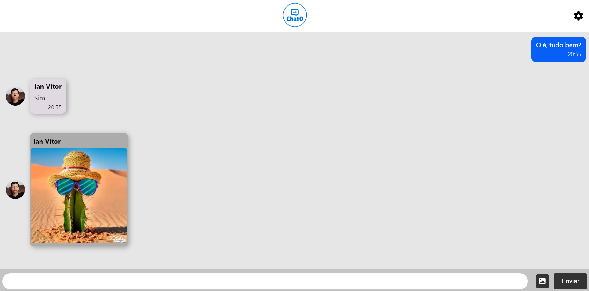

# Teste Chat
 teste de socket.io
 

    <h3> 🔵 Chat de bate papo em tempo real! 🔵 </h3>

Chat em tempo real, feito com a biblioteca socket.io.
##

  

## 🛠️ Tecnologias
<ul>
 <dd> HTML5</dd>
 <dd> CSS3</dd>
 <dd> JavaScript</dd>
</ul> 
